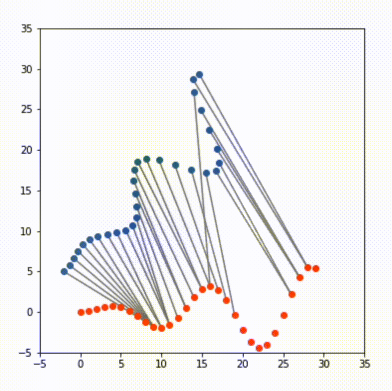
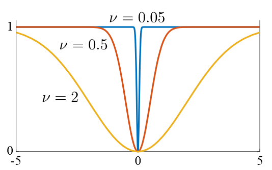
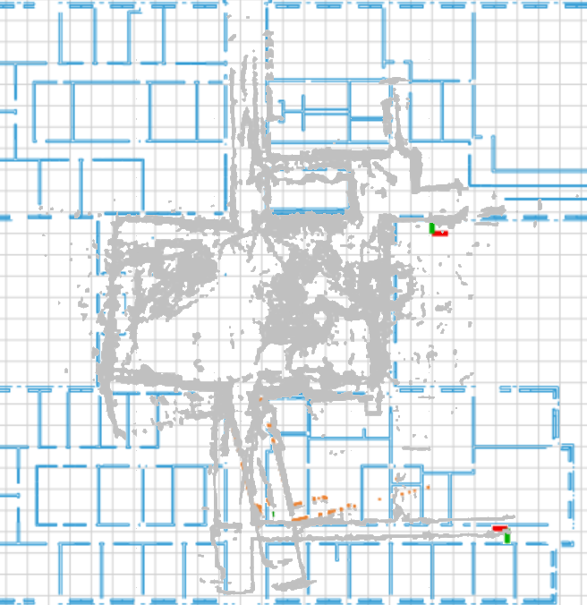

## Navigation

- Implemented autonomous navigation on F1/10 car alongside two group members
- <ins>Particle filter</ins> so the car could localize itself within a given static map
- <ins>A*-based algorithm</ins> for path planning within the map and navigation around unexpected obstacles

## SLAM

- Simultaneous Localization And Mapping (SLAM): used
  by <a href="https://spectrum.ieee.org/irobot-brings-visual-mapping-and-navigation-to-the-roomba-980" target="__blank">
  autonomous robots</a> to map and navigate unfamiliar environments
- Implemented <ins>LiDAR-based SLAM</ins> using point-to-point iterative closest point (ICP)
    - ICP iteratively aligns point clouds by comparing & reducing translational and rotational error
    - Point-to-point ICP calculates error based on distance between closest points

<figcaption>ICP</figcaption>

- Problem: how do we align point clouds that don't match exactly (i.e. when the car is in motion)?
- Solution: <ins>outlier rejection</ins> using non-dynamic version of Welch function (below)
    - More heavily weight points that are "closer" to the previous scan

- Below: demonstration of our SLAM implementation in the Gates-Dell Complex (2nd floor) at UT Austin
- Did accumulate error over time &mdash; especially for GDC2, which has a large, open atrium

