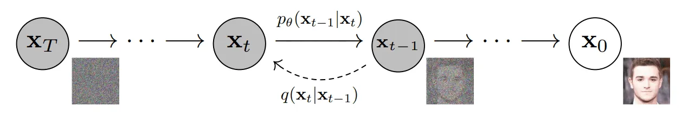
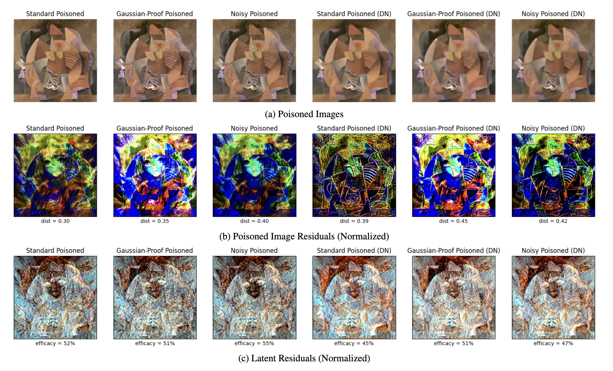

## Motivation

- How can artists protect their work from unauthorized use in generative model training?
- Companies controlling these models are already mishandling/misusing customer data
- Currently have to rely on opt-out forms (only available for some models)

## Nightshade

- Background: image generation models are <ins>diffusion models</ins>
    - They encode images into a latent feature space, then learn to decode from latent space

- <a href="https://nightshade.cs.uchicago.edu/whatis.html" target="_blank">Nightshade</a>: a diffusion model poisoner
  created by Shawn Shan et al. at UChicago
- Modifies a target image to appear similar in latent space to an anchor image (in a different category), but unmodified
  to human eyes
- This "poisons" a model by preventing it from generating correct images
- A simple defense: denoise images before training a model

## Noise-Proofed Nightshade

- Modified the optimization problem in Nightshade to minimize distance between a *denoised* target image and its anchor
- NPN was unaffected by denoising techniques, unlike standard Nightshade
- Also experimented with "Denoised Nightshade", which attempted to minimize the noise in the poisoned image itself
- DN was somewhat effective, but not as effective as NPN

