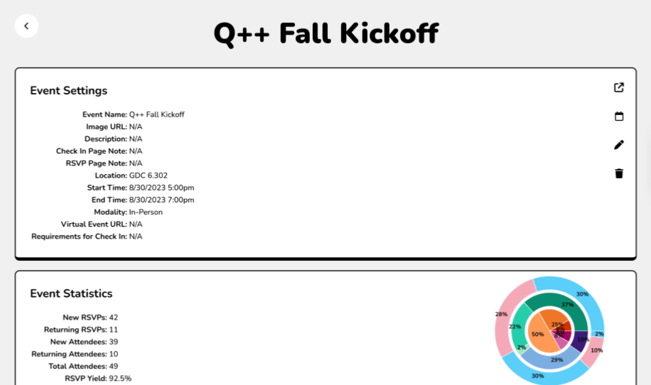

## Motivation

- Currently president of Q++, UT Austin's organization for LGBT people in CS
- Problem: keeping track of event attendees is difficult
    - Would have separate Google forms
    - Would end up with tens of spreadsheets
    - Wouldn't do much with our data
- Would also have joint events with other orgs
    - Additional difficulty with spreadsheet access
    - Hard to easily divide data between orgs

## The Tool

- Cobuilt with another officer in React and Firebase
- Keeps track of events and attendees across different semesters
- Auto-generates statistics regarding RSVPs, check-ins, and student demographics
- Downloadable in CSV format for further manipulation
- Integrates with Google Calendar
- Can link events between orgs, with custom check-in/RSVP pages for each org

