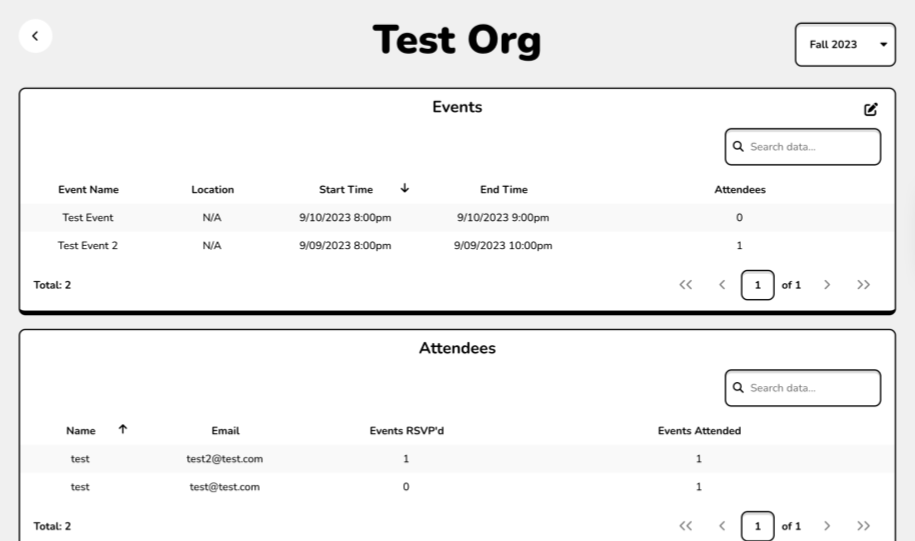

As an officer of Q++, keeping track of attendees at our various events proved to be very difficult. Usually, we would
use a Google form and end up with tens of spreadsheets containing duplicate attendee data, with no easy way to
consolidate these spreadsheets or gain anything meaningful from them (such as what kinds of events were most popular,
how many RSVPs carried over to attendees, even general attendee demographics).

The solution to this problem was Org Assistant. allows
members to easily check in and saves their previously entered data locally, so that they don't need to re-type all of
their information for each event. Each event contains auto-generated statistics regarding RSVPs, check-ins, and
demographics like graduation year, and all check-ins are consolidated into a master list of attendees. Org Assistant
also allows the user to download a CSV containing this data, in case check in or attendee data needs to be manipulated
or exported.

