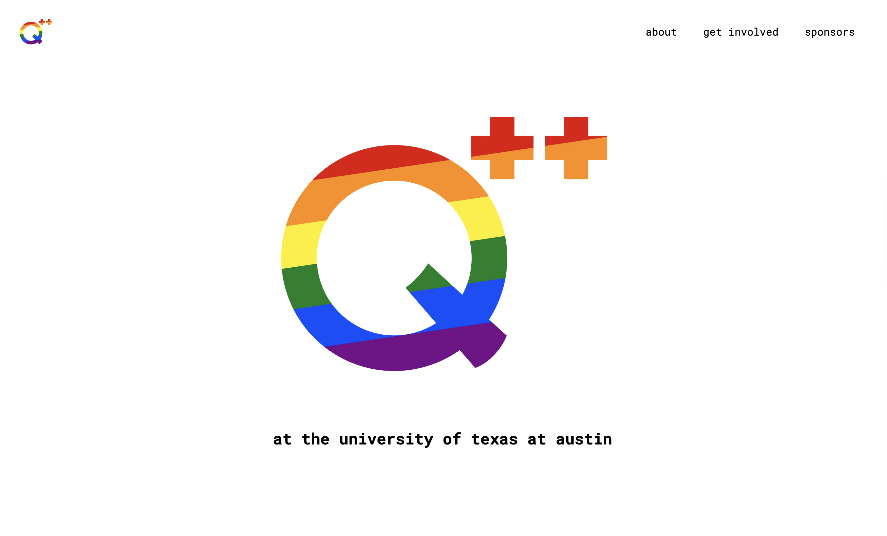

- Built website from scratch for Q++, org for LGBT people in computer science at UT Austin
- Uses Gatsby (fast!) and Contentful (customizable!)
- Fetches events calendar directly from Org Assistant

