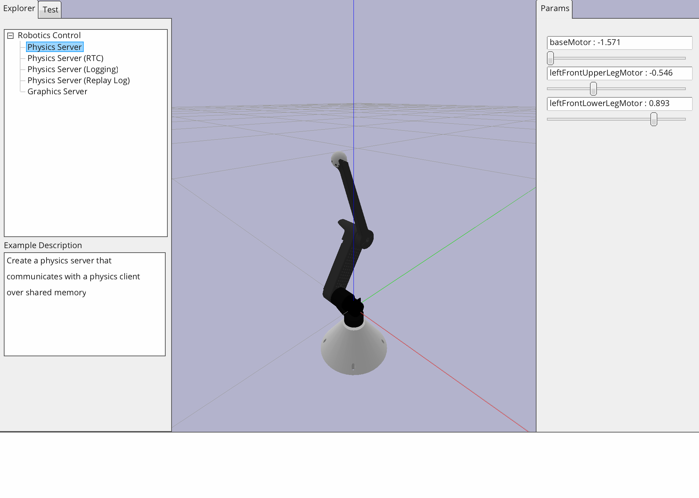

- 3D printed, assembled, and wired one arm of <a href="https://www.youtube.com/watch?v=_Sh4kRtmAog" target="__blank">
  Stanford Pupper Robot</a>
- Worked with 2 group members
- Implemented forward and inverse kinematics for arm's end-effector

## Adding computer vision

- Programmed arm to track a red dot from a laptop camera
- Used OpenCV
- What not to do: disable safeguards while trying to debug
    - Broke our robot arm (twice!)
    - Were able to get the code working, but no physical arm to run it on :(

<iframe
src="https://drive.google.com/file/d/1aW8GShbJa_nvSgMrsHAPHexv3npq6He0/preview"
width="500"
height="273"
style={{border: "none"}}
allow="autoplay"
allowFullScreen></iframe>