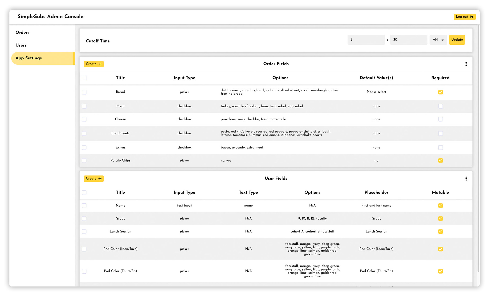

## Origins

- Began designing system in 2019 to replace existing sandwich ordering system
    - Current system: had to write order on slips before school each day
    - Alternative to preordering: wait 30+ minutes (over half of lunch period) in line for lunch
- By 2020, Simple Subs went from nice-to-have to essential part of the school's COVID response plan

## The App

- Allows ordering up to 14 days in advance
- Students can place custom orders or create their own sandwich presets
- Used by all students and faculty on campus, and still in use to this day

## Admin Console

- Console where cafeteria staff can easily update menu
- Can also adjust required profile information for students
    - Ex: during COVID, students were separated into lunch pods
    - Pod information could be easily added to profile along with name and grade
- Staff can also manage, edit, and download/upload student and app information

## Automated Printing

- Raspberry Pi + label printer automatically prints lunch orders at a preconfigured time
- Easier for students to find lunch &mdash; don't have to read handwriting
- Allows staff to not have to worry about using the console or manage orders on the day-to-day

