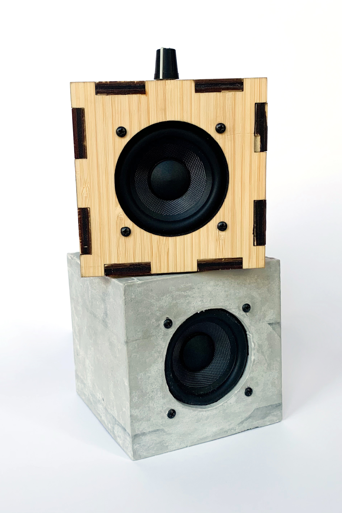
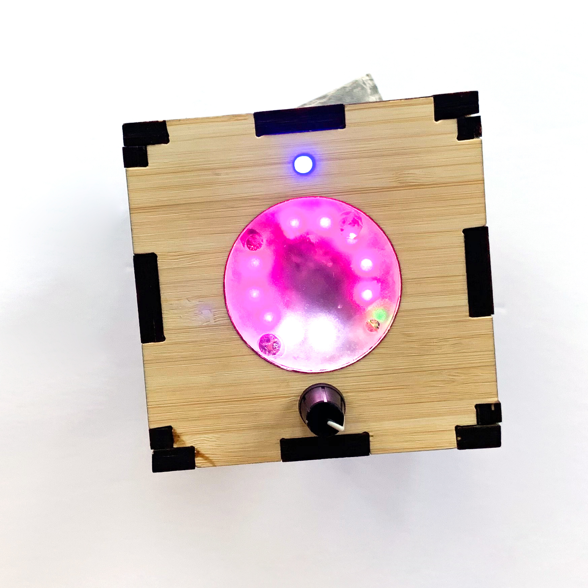

- Designed to be simple &mdash; focus on craft
- Used wood for top layer, Rockite (quick-drying cement/hydraulic expansion cement) on bottom layer

- Programmed LEDs on Adafruit Circuit Playground to react to sound
    - LED colors change based on frequency (pitch) of music
    - Number of illuminated LEDs change based on volume
    - Different genres and songs display different patterns

<iframe width="560" height="315" src="https://www.youtube.com/embed/uxe4buU6ngE" title="Circuit Playground - A&amp;D 2020" frameborder="0" allow="accelerometer; autoplay; clipboard-write; encrypted-media; gyroscope; picture-in-picture; web-share" referrerpolicy="strict-origin-when-cross-origin" allowfullscreen></iframe>